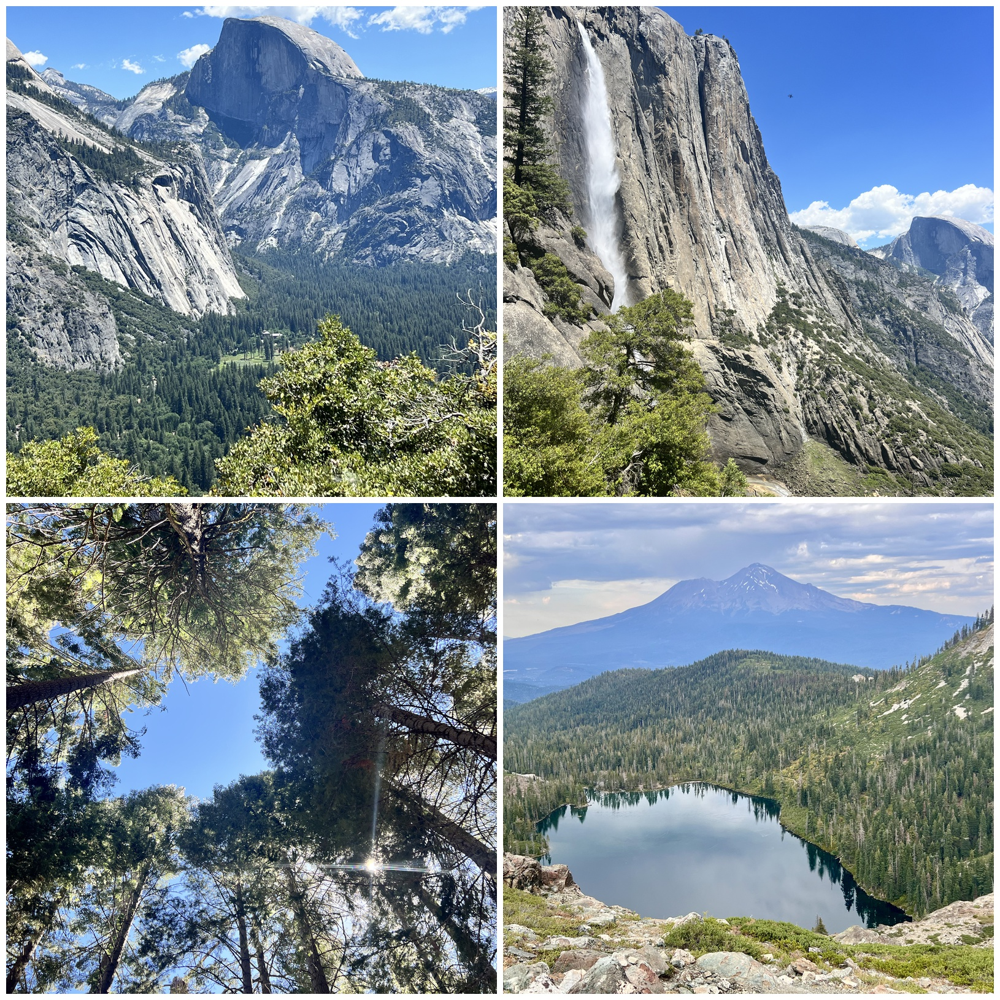

# Pack for This Hike: A Safety-First, Multi-Agent Hiker Packing Assistant

## Project Origin & Value Proposition

### The Origin Story
As an avid hiker, I have experienced firsthand the consequences of inadequate trail preparation. Exploring unfamiliar destinations, differing climates, and unpredictable terrains often leaves hikers exposed to significant risks. Traditional packing lists are generic, static, and fail to account for the unique characteristics of a specific trail, real-time meteorological shifts, or personal physical constraints. A simple oversight—such as underestimating elevation gain, miscalculating water consumption, or ignoring the timing of local sunset—can escalate a pleasant day hike into a search-and-rescue emergency. This project was born out of a desire to bridge the gap between real-world environmental facts and personalized preparedness.



### Core Value Proposition
**Pack for This Hike** is a nature-, terrain-, and climate-aware packing assistant that uses an autonomous multi-agent hierarchy to construct highly personalized, safety-first packing checklists. By integrating real-time trail data retrieval and hyper-localized weather forecasts, the system eliminates guesswork. 

Unlike conventional tools that output standard gear lists, **Pack for This Hike** features:
1. **Fact-Driven Customization**: Adjusts recommendations based on terrain slope, trail length, elevation profile, and localized forecast temperatures.
2. **Sources Transparency**: Clearly labels the origin of every packing recommendation (whether it was fetched from database facts, provided by the user, or inferred via safety algorithms) to build trust.
3. **Graceful Fallback Engineering**: Operates reliably in offline/mock mode with simulated environmental faults (timeouts, stale data, missing records) to guarantee continuous availability.

---

## Technical Architecture & Multi-Agent Framework

Built with the **Google Antigravity SDK**, **FastAPI**, and **Vanilla HTML/CSS/JS**, the system orchestrates multiple autonomous agents using an explicit **Plan → Act → Observe** lifecycle.

```mermaid
graph TD
    User([User Input: Trail Name & Preferences]) --> MainAPI[FastAPI Backend]
    MainAPI --> Orch[HikePlanningOrchestrator]
    
    subgraph Plan -> Act -> Observe Loop
        Orch -- Spawns --> TrailAgent[TrailFactsSubAgent]
        Orch -- Spawns --> WeatherAgent[WeatherSubAgent]
        
        TrailAgent -- get_trail_facts --> TF_Tool[Trail facts Retrieval Tool]
        WeatherAgent -- get_weather_data --> W_Tool[Weather Retrieval Tool]
        
        TF_Tool -.-> TF_Data{Trail JSON}
        W_Tool -.-> W_Data{Weather JSON}
        
        TF_Data -.-> Orch
        W_Data -.-> Orch
    end
    
    Orch --> SafetyCalc[Safety Parameter Calculator]
    SafetyCalc --> PackAdvisor[PackingAdvisory LLM Agent]
    PackAdvisor --> FinalJSON[Structured Packing Recommendations]
    FinalJSON --> UI[Interactive Frontend Checklist]
```

### The Plan → Act → Observe Lifecycle
1. **Plan**: The root coordinator, `HikePlanningOrchestrator`, examines the user request. It determines which sub-agents to dispatch. It always dispatches the `TrailFactsSubAgent`. If latitude and longitude are resolved, it schedules the `WeatherSubAgent` to fetch coordinates-based forecasts.
2. **Act**: The coordinator programmatically builds and executes the sub-agents. Each sub-agent is initialized in isolation, loaded with its designated `SKILL.md` persona, and equipped with a single, highly restricted custom Python tool.
3. **Observe**: The coordinator gathers the JSON payloads emitted by the sub-agents, parses them, validates their contents, merges the environmental attributes, and handles error states or offline fallbacks.

---

## Agent-by-Agent Deep Dive & Skills Utilization

To enforce modularity and prevent prompt leakage or cross-contamination, the system separates concerns into isolated sub-agents. Each agent is guided by a specific skill instructions file (`SKILL.md`).

### 1. HikePlanningOrchestrator (Root Coordinator)
* **Role**: Acts as the master orchestrator, executing the high-level sequential pipeline, managing the state, and aggregating sub-agent outputs.
* **Skill File (`orchestrator.md`)**:
  * **How it helps**: Defines the sequence of sub-agent dispatch. It instructs the coordinator to construct the environment details first, pass coordinates to the weather agent, combine the metrics, and run the packing list advice. It also embeds the core baseline parameters (such as the `0.5L / hour` baseline water consumption and the conditions under which to escalate water or gear recommendations) so that the orchestrator enforces these thresholds consistently.

### 2. TrailFactsSubAgent
* **Role**: A dedicated factual researcher whose sole objective is to discover and extract structural trail characteristics (distance, elevation gain, trailhead location, and terrain description).
* **Skill File (`backend/skills/trail_agent/SKILL.md`)**:
  * **How it helps**: Sets a strict persona of an objective research assistant. It explicitly instructs the agent to refuse any queries outside the domain of trail facts. It outlines the schema-matching requirements for the output JSON and dictates the response logic for the `USE_REAL_TIME_DATA` runtime parameter.
  * **Tools**:
    * `get_trail_facts(destination)`: Resolves trail parameters. In real-time mode, it leverages the **Brave Search MCP server** to fetch live details; in mock mode, it queries local database stubs.

### 3. WeatherSubAgent
* **Role**: A localized environmental parser that determines meteorological conditions, including temperatures, conditions, wind speeds, humidity, and sunrise/sunset times.
* **Skill File (`backend/skills/weather_agent/SKILL.md`)**:
  * **How it helps**: Mandates coordinate validation (checking that latitude falls within `[-90, 90]` and longitude within `[-180, 180]`) before running any tools. It prevents conversational pleasantries and forces the agent to output a single, validated JSON block adhering to a precise schema.
  * **Tools**:
    * `get_weather_data(lat, lon)`: Fetches weather data. In real-time mode, it leverages the **OpenWeather API MCP server**; in mock mode, it checks localized bounding boxes.

### 4. PackingAdvisory Sub-Agent / Logic
* **Role**: Integrates the collected environmental details and user inputs (pace, footwear, poles, starting hour) to compile the final packing recommendations.
* **Skill File (`backend/skills/packing_advisory.md`)**:
  * **How it helps**: Directs the interviewer to format user inputs cleanly, maps them to the frontend questionnaire elements, and enforces strict boundary checks (e.g., validating that hiking pace falls into slow, moderate, or fast categories) to protect the LLM from processing erratic inputs.

---

## Conservative Safety & Recommendation Logic

To guarantee that hiking safety recommendations are not subject to LLM "hallucinations," **Pack for This Hike** combines deterministic algorithmic calculations with agentic synthesis.

### 1. Water Calculation Formula
The application starts with a baseline water intake requirement:
\[W_{\text{baseline}} = 0.5 \text{ L/hour}\]
This rate is dynamically adjusted based on environmental factors:
* **High Heat**: If the forecast temperature exceeds \(75^{\circ}\text{F}\), the rate increases by \(0.2\text{ L/hour}\). If it exceeds \(85^{\circ}\text{F}\), it increases by another \(0.2\text{ L/hour}\) (a total increase of \(0.4\text{ L/hour}\)).
* **Elevation Strain**: If elevation gain exceeds \(1,500\text{ feet}\), the rate increases by \(0.1\text{ L/hour}\). If it exceeds \(3,000\text{ feet}\), it increases by an additional \(0.1\text{ L/hour}\).
* **Safety Minimum**: The total water recommendation is capped at a minimum of \(1.0\text{ Liter}\) regardless of duration.

### 2. Sunset & Headlamp Trigger
Safety guidelines dictate that hikers should not be caught in the dark without illumination. The system calculates the estimated completion time:
\[T_{\text{end}} = T_{\text{start}} + \text{Duration}\]
The estimated end time is compared against the fetched local sunset time:
* **Must Bring**: If the hike is estimated to finish within 60 minutes of sunset or after sunset, a **Headlamp or Flashlight** is categorized as `### 🔴 Must Bring`.
* **Recommended**: If completion falls within 60 to 120 minutes before sunset, the item is categorized as `### 🟡 Recommended Good to Have` (to account for unexpected trail delays).
* **Optional**: If completion is more than 120 minutes before sunset, it is marked as `### 🟢 Optional`.

### 3. Footwear Warning System
The system scans the terrain description for hazard keywords (e.g., *"steep"*, *"rocky"*, *"granite"*, *"gravel"*, *"switchback"*, *"root"*). If tough terrain is detected and the user selects "sneakers" or "sandals" as their preference, the system flags a **Footwear Hazard** under safety inferences and recommends supportive trail runners or hiking boots.

### 4. Portable Charger Trigger
* **Must Bring**: If the estimated duration of the hike exceeds **8 hours**, a portable phone charger is flagged as a mandatory item to ensure emergency communication lines remain open.
* **Recommended**: If the hike duration is between **5 and 8 hours**, a charger is marked as highly recommended.

---

## Security & Safety Guardrails (Zero-Trust Agent Configuration)

A standout aspect of this project is its adherence to strict security standards. LLM agents can be vulnerable to prompt injection, arbitrary tool misuse, or unsafe system commands. **Pack for This Hike** mitigates these risks at the SDK level.

### 1. Terminal Sandboxing
All agents—including the root orchestrator and individual sub-agents—are configured with:
```python
enable_terminal_sandbox=True
```
This isolates the agent execution environment, ensuring they have no direct access to the host's underlying file system, shell, or environment variables unless explicitly permitted.

### 2. Hard Capability Restriction
To implement a "least privilege" model, the agents are stripped of all general-purpose capabilities. The `disabled_tools` configuration block strictly disables:
* Command execution (`RUN_COMMAND`)
* File creation/editing (`CREATE_FILE`, `EDIT_FILE`)
* Image generation (`GENERATE_IMAGE`)
* Sub-agent spawning (`START_SUBAGENT` is disabled for child agents to prevent unbounded, expensive delegation loops).

### 3. Policy-Based Guardrails
The system implements SDK-enforced policies that prevent unauthorized activity:
```python
policies=[policy.deny("run_command")]
```
Even if an agent experiences a prompt injection attack trying to force it to run a terminal command, the policy blocks the action before execution.

### 4. Strict Input Validation
Using **Pydantic**, the application validates all boundaries at the API gateway:
* Query parameters are trimmed and validated.
* Geographic coordinates are verified using mathematical bounds (\(lat \in [-90, 90]\), \(lon \in [-180, 180]\)).
* Custom retry hooks (`_FallbackHook`) catch validation tracebacks, returning a safe, sanitized feedback message to the model instead of exposing raw database or system paths.

---

## Real-Time vs. Simulation Adaptability

To ensure the system works reliably in real-world scenarios, the backend operates on a togglable flag: `USE_REAL_TIME_DATA`.

### 1. Real-Time Mode (`USE_REAL_TIME_DATA=True`)
* The **TrailFactsSubAgent** initiates the **Brave Search MCP server** to fetch live details for any trailhead query from authoritative government, state park, or geological databases.
* The **WeatherSubAgent** calls the local **OpenWeather MCP server** to fetch current wind, temperature, humidity, and sun metrics for the resolved trailhead coordinates.

### 2. Offline Simulation Mode (`USE_REAL_TIME_DATA=False`)
To facilitate robust testing and demonstrate compliance with real-world failure states, the simulation mode supports keyword triggers:
* **`timeout`**: Injects simulated network latency, causing the weather agent tool to time out. The frontend handles this by displaying a warning banner with a **Retry** trigger.
* **`fail`**: Simulates a 404 response. The application responds by prompting the user with a manual-entry UI panel, transitioning the packing recommendations into a lower-confidence state.
* **`stale`**: Injects a timestamp older than 2 hours. The system alerts the user that the weather data might be outdated, updating the gear recommendations with caution notices.

---

## UI/UX & User Empowerment

The frontend is built using a clean, responsive single-page design utilizing modern styling principles (vibrant status indicators, clean cards, Inter/Outfit typography, and micro-animations) to maximize usability in the field.

* **Progress Tracker**: Guides the user through the 3-step pipeline: *Select Trail* → *Refine Details* → *Gear Guide*.
* **Status Banners**: Injects bright, clear warning cards immediately when data is stale, missing, or timed out.
* **Metadata Badges**: Labels every checklist item with its confidence level (High vs. Lower) and its data source (Fetched, User Provided, or Inferred) so the user understands exactly *why* each piece of gear is suggested.
* **Interactive Checklist**: Allows users to check off items as they pack, saving state dynamically.

---

## Summary of Project Value

**Pack for This Hike** addresses a critical need in outdoor recreation. By combining the natural language capability of LLMs with deterministic safety formulas and strict sandbox policies, it demonstrates a secure and practical implementation of agentic AI. It provides hikers with a personalized, transparent, and context-aware packing companion—making outdoor adventure safer and more accessible.
